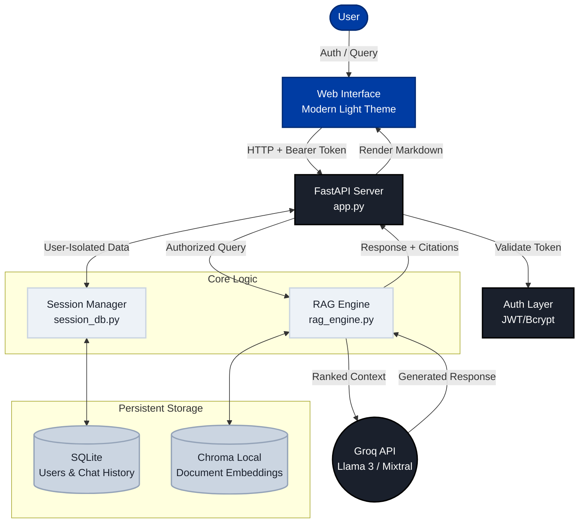

# VANT AI - Modern Professional RAG Chatbot

VANT AI is a high-performance Retrieval-Augmented Generation (RAG) application designed for privacy-conscious professionals. It features a secure, multi-user environment and a clean, modern interface optimized for productivity.

## 🚀 Key Features

- **Secure Authentication**: Robust JWT-based login and signup system with encrypted password storage.
- **User-Specific Workspace**: Isolated chat sessions and document storage for every user.
- **Hybrid Search Engine**: Combines **Semantic Search** (Vector-based with MMR) with **Keyword Search** (BM25) for high-accuracy retrieval using optimized embeddings (all-mpnet-base-v2).
- **Persistent Chat Sessions**: Full session management with history saved in a local SQLite database.
- **Dynamic Model Switching**: Toggle between advanced Llama 3 models (via Groq) instantly.
- **Document Intelligence**: Multi-format support (PDF, DOCX, TXT, CSV, XLSX) with 3-bullet summarization.
- **Modern Professional UI**: A clean, "GeeksForGeeks" inspired light theme built for focus and ease of use.

## 🛠️ Tech Stack

- **Backend**: FastAPI (Python)
- **Auth**: JWT (PyJWT) & Bcrypt
- **Database**: SQLite (SQLAlchemy) for users/sessions & ChromaDB for vectors
- **Orchestration**: LangChain (Conversational RAG Chain with optimized chunking: 800 chars, 150 overlap)
- **LLM Engine**: Groq (Llama-3 / Mixtral models)
- **Embeddings**: HuggingFace Transformers (all-mpnet-base-v2 for high-accuracy vectors)
- **Frontend**: Vanilla HTML5/CSS3 (Modern Professional Theme), JavaScript (ES6)

## 🏗️ Architecture & Workflow



## 📋 Quick Start

1. **Install Dependencies**:
   ```bash
   pip install -r requirements.txt
   ```

2. **Environment Setup**:
   Create a `.env` file:
   ```env
   GROQ_API_KEY=your_key
   SECRET_KEY=generate_a_random_string
   ```

3. **Run the App**:
   ```bash
   uvicorn app:app --host 127.0.0.1 --port 9005
   ```

4. **Access**:
   Navigate to [http://127.0.0.1:9005](http://127.0.0.1:9005) and create your account.

## � Recent Optimizations

- **Enhanced Retrieval Accuracy**: Upgraded to all-mpnet-base-v2 embeddings (768D) for better semantic understanding.
- **Improved Chunking**: Optimized document splitting (800 chars with 150 overlap) for precise context extraction.
- **Advanced Search**: Implemented MMR (Maximal Marginal Relevance) in vector retrieval to reduce redundancy and improve relevance.
- **Code Cleanup**: Removed unused imports and duplicate files for better maintainability.

## �📄 License
MIT License.
