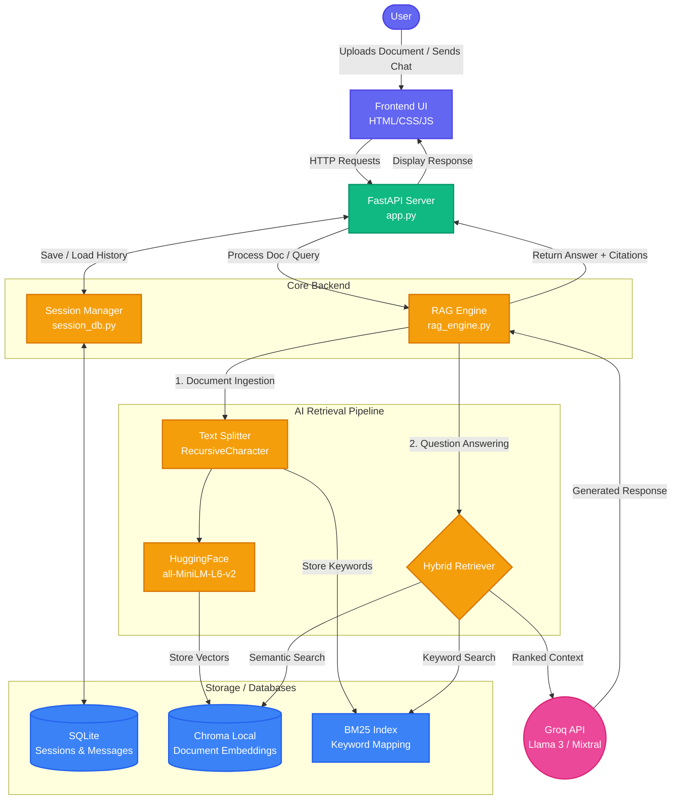

# VANT AI - Premium Private RAG Chatbot

VANT AI is a modern, high-performance Retrieval-Augmented Generation (RAG) application designed for privacy-conscious users. It allows you to chat with your local documents (PDF, DOCX, TXT, CSV, XLSX) using a sophisticated Hybrid Search engine and a premium glassmorphic interface.

## 🚀 Key Features

- **Hybrid Search Engine**: Combines **Semantic Search** (Vector-based) with **Keyword Search** (BM25) for unmatched retrieval accuracy.
- **Persistent Chat Sessions**: Full session management with history saved in a local SQLite database.
- **Dynamic Model Switching**: Switch between different Llama 3 models (via Groq) on the fly without restarting the server.
- **Document Summarization**: Instantly generate 3-bullet summaries for any indexed document.
- **High-Performance RAG**: Uses HuggingFace embeddings (`all-MiniLM-L6-v2`) and ChromaDB for fast, local indexing.
- **Multi-Format Mastery**: Robust processing for PDF, Word, Text, CSV, and complex Excel files.
- **Premium Glassmorphic UI**: High-end user experience with real-time markdown rendering and smooth animations.

## 🛠️ Tech Stack

- **Backend**: FastAPI (Python)
- **Database**: SQLite (SQLAlchemy) for sessions & ChromaDB for vectors
- **Orchestration**: LangChain (Conversational RAG Chain)
- **LLM Engine**: Groq (Llama-3 models)
- **Retriever**: Hybrid (VectorStore + BM25)
- **Frontend**: Vanilla HTML5/CSS3 (Glassmorphism), JavaScript (ES6)

## 🏗️ Architecture & Workflow

Here is the complete data flow and system architecture for VANT AI:



## 📋 Prerequisites

- Python 3.9+
- A Groq API Key (Get it at [console.groq.com](https://console.groq.com/))

## ⚙️ Installation & Setup

1. **Clone the repository**:
   ```bash
   git clone https://github.com/SiddheshUgale73/VANT-AI.git
   cd VANT-AI
   ```

2. **Set up a Virtual Environment**:
   ```bash
   python -m venv venv
   # Windows:
   venv\Scripts\activate
   # macOS/Linux:
   source venv/bin/activate
   ```

3. **Install Dependencies**:
   ```bash
   pip install -r requirements.txt
   ```

4. **Environment Configuration**:
   Create a `.env` file in the root directory:
   ```env
   GROQ_API_KEY=your_groq_api_key_here
   HOST=127.0.0.1
   PORT=9000
   DEBUG=True
   ```

## 🏃 Running the App

1. **Start the FastAPI server**:
   ```bash
   uvicorn app:app --host 127.0.0.1 --port 9000
   ```

2. **Open your browser**:
   Navigate to [http://127.0.0.1:9000](http://127.0.0.1:9000)

## 📂 Project Structure

```text
VANT-AI/
├── static/              # Frontend assets (HTML, CSS, JS)
├── vector_db/           # ChromaDB vector database
├── app.py               # FastAPI Backend Server (Core)
├── rag_engine.py        # Core RAG Logic & Hybrid Search
├── session_db.py        # SQLite Session Management
├── config.py            # Global Settings & Models
├── requirements.txt     # Python Dependencies
├── .env                 # API Keys (Local Only)
├── chat_history.db      # SQLite database for chat sessions
└── README.md            # This file
```

## 📖 How to Use

1. **Create a Session**: Click "New Chat" in the sidebar to start a fresh conversation.
2. **Upload Docs**: Drag and drop or click to upload files. VANT AI will automatically index them.
3. **Select Model**: Use the top-right selector to choose your preferred AI model.
4. **Chat & Explore**: Ask questions. Use the "Summarize" button next to uploaded files for a quick overview.
5. **Citations**: Hover over the source badges in AI responses to see the exact document referenced.

## 🛡️ Privacy & Security

VANT AI is built for privacy. Your documents are indexed locally, and only the specific relevant chunks (along with your prompt) are sent to Groq for processing. No data is stored permanently outside your local environment.

## 🤝 Contributing

Contributions are welcome! Please feel free to submit a Pull Request.

## 📄 License

This project is licensed under the MIT License.
